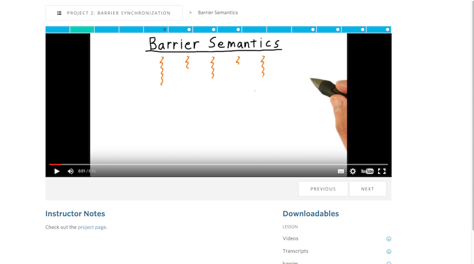

# minimal-udacity-classroom
Removes extraneous features from the classroom viewer

To install:
 1. First, install either [greasemonkey](https://addons.mozilla.org/en-US/firefox/addon/greasemonkey/) for firefox or [tampermonkey](https://chrome.google.com/webstore/detail/tampermonkey/dhdgffkkebhmkfjojejmpbldmpobfkfo?hl=en) for chrome
 1. Open https://raw.githubusercontent.com/jobevers/minimal-udacity-classroom/master/minimal-udacity-classroom.user.js

## Result

The header, footer, course title, and sidebars are removed, leaving only the video player and notes.

